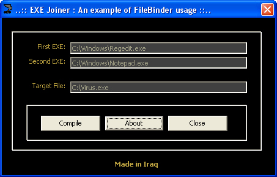



## EXE Joiner®

### Description

Great code for merging two executables into one, and when you run the new file, both of the programs will run with it, NO API, NO DLL!!!

- Base on my project, "FileBinder"

Please vote for me...
 
### More Info
 

             |
---                |---
**Submitted On**   |2004-01-30 18:22:20
**By**             |[BlackTornado](https://github.com/Planet-Source-Code/PSCIndex/blob/master/ByAuthor/blacktornado.md)
**Level**          |Advanced
**User Rating**    |3.7 (26 globes from 7 users)
**Compatibility**  |VB 5\.0, VB 6\.0
**Category**       |[Files/ File Controls/ Input/ Output](https://github.com/Planet-Source-Code/PSCIndex/blob/master/ByCategory/files-file-controls-input-output__1-3.md)
**World**          |[Visual Basic](https://github.com/Planet-Source-Code/PSCIndex/blob/master/ByWorld/visual-basic.md)
**Archive File**   |[EXE\_Joiner1710722192004\.zip](https://github.com/Planet-Source-Code/blacktornado-exe-joiner__1-51867/archive/master.zip)

